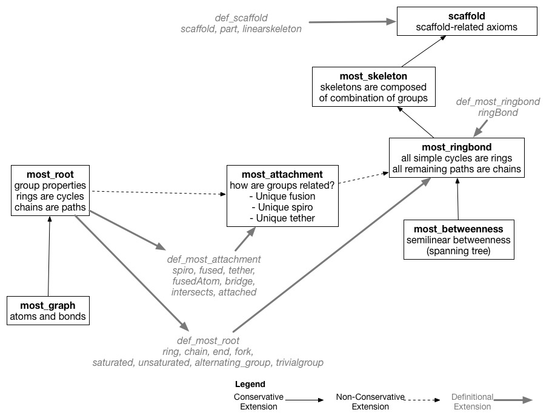

# MOlecular Structure Ontology (MoSt)

This repository directory contains the theories found in the MOlecular Structure Ontology (MoSt) written in the Common Logic syntax.

Major Changes
=============
- allowed for multiple fusion to handle bridges in molecules
- april 21, 2017: renamed all inBond/inGroup/etc. relations to mol(x,y) - all axioms will now require sort constraints

Major Design Decisions
======================
The ontology represents atoms, bonds, functional groups, and skeletons as elements of the domain in the ontology, and imports theories from [molecular_graph](https://github.com/gruninger/colore/blob/master/ontologies/molecular_graph/).

The ontology allows for:
- multiple fusion to support bridges
- unique spiro
- unique tether

Verification of Theories
================================================
- This ontology has been verified with theories found in the [tripartite_incidence](https://github.com/gruninger/colore/blob/master/ontologies/tripartite_incidence/) hierarchy.
- See the [mappings](https://github.com/gruninger/colore/blob/master/ontologies/most/mappings/) folder for translation definitions.
- See the [interprets](https://github.com/gruninger/colore/blob/master/ontologies/most/interprets/) folder for proofs.